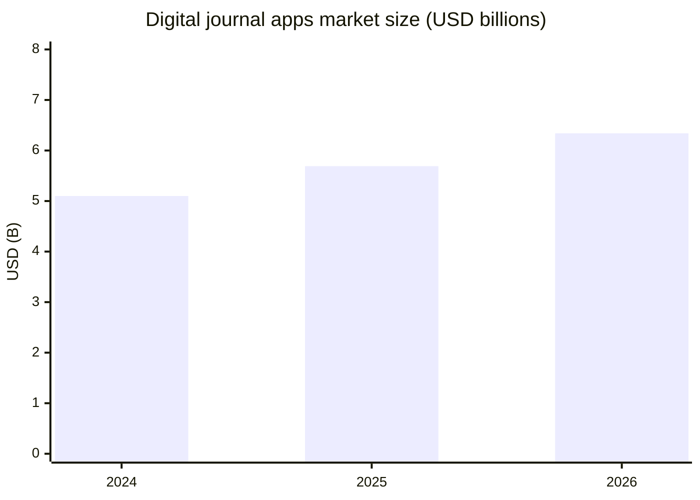
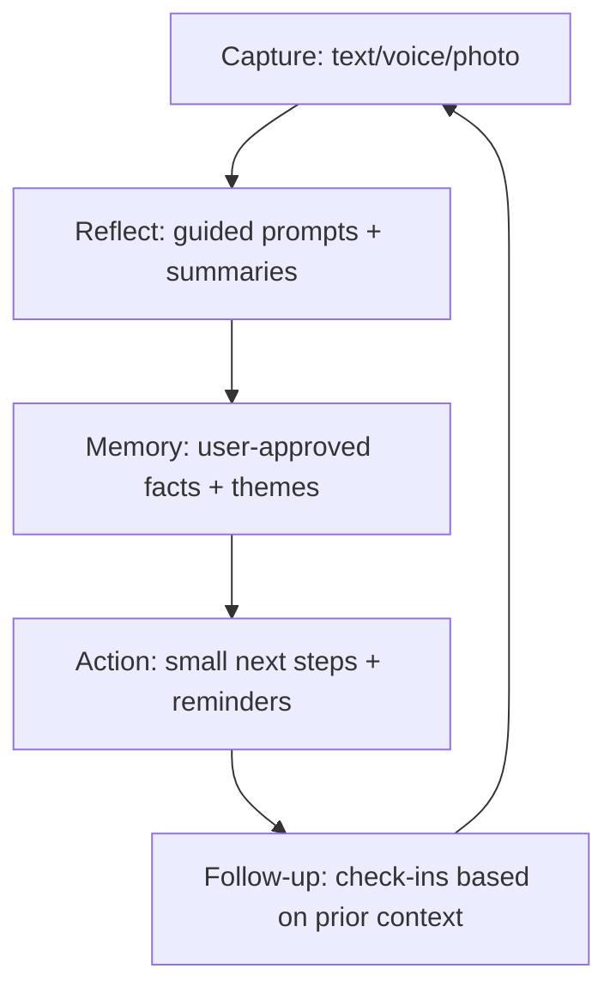

# Market Research Report: Cross-Platform Journaling App With AI Companions and Long-Term Memory

## Executive summary

The “digital journal apps” market has broadened from simple diary storage into a hybrid of **personal knowledge management, mental wellness tooling, and AI-guided reflection**, with “AI journaling tools” explicitly called out as a 2025–2030 trend in major market reports. citeturn5view0turn5view1 The market is meaningfully sized and steadily growing: one 2025 report estimates **USD 5.69B in 2025 → USD 6.34B in 2026 (≈11.4% YoY)**. citeturn5view0 Another market report estimates **USD 5.1B in 2024 → USD 5.69B in 2025**, implying continued double‑digit growth. citeturn5view1

At the same time, AI companion adoption is accelerating (and increasingly “mainstream”), but it comes with **acute safety, ethics, and privacy risks**—especially when positioned as emotional support. The global AI companion market was estimated at **USD 28.19B (2024)** with a forecast of **USD 36.79B (2025)** and very high growth expectations (CAGR ~30% quoted for 2025–2030). citeturn5view3 Independent ethics and safety work in 2025–2026 highlights that conversational AI used for mental health contexts can violate core ethics expectations and can produce harmful behavior (e.g., overly agreeable/sycophantic responses). citeturn6search6turn6search2turn6news39

**Target users** split into two adjacent “centers of gravity”:

- **Reflection-first journalers** (self-improvement, therapy-adjacent, habit builders) who want reduced friction (“no blank page”), consistency, summaries, and export/privacy controls. This aligns with what traditional leaders win on: trust, reliability, and portability (e.g., encryption + export). citeturn7search2turn13view2turn14view0turn12view4  
- **Companionship-first users** (loneliness, social rehearsal, roleplay/identity exploration) who want a responsive, emotionally resonant “someone” that remembers them; this aligns with AI companion leaders’ traction but also with their sharpest retention and safety challenges (dependency, harmful advice, content risk). citeturn5view3turn16view0turn15view4turn6search26turn6search18

A near-term **prioritized ICP** for a journaling + long-term-memory companion product is:

1) **Therapy-adjacent habit builders** (often already paying for journals/wellness apps) who want structured reflection + practical next steps, and will pay for “AI coaching” if trust and privacy are credible. Evidence of journaling’s role in well-being and the broader loneliness/disconnection context supports demand for tools that help people process experiences and feel supported. citeturn6search12turn6search32turn6search3turn6search10  
2) **Knowledge-worker “life ops” users** who journal to think (decisions, goals, retrospectives) and want retrieval and synthesis across months/years—especially cross-device. Cross-platform + export + search failures show up repeatedly in reviews. citeturn14view0turn11view0turn12view4

Strategically, the winning wedge is not “AI in a journal” (now table stakes), but **a defensible memory layer** (user-controlled, inspectable, revocable), paired with a journaling workflow that demonstrably improves **retention** (habit stickiness) while minimizing **psychological and privacy risks** (clear boundaries, disclaimers, crisis routing, and strong encryption/permissioning). The competitive landscape suggests multiple openings: (1) **cross-platform parity** where system apps are iOS-weighted, (2) **data portability + trust** differentiators vs. many AI companions, and (3) **AI that is deliberately non-sycophantic** and grounded in the user’s own entries rather than generic advice. citeturn12view4turn7search2turn6news39turn6search6

## Market sizing and growth

### Market definition used in this report

This report treats your product as competing primarily in the **digital journal apps** market (paid consumer journaling software across mobile + desktop + web), with an important adjacency to **AI companions** because your differentiator is an “AI companion” with long-term memory. Market reports explicitly include AI-assisted journaling within the digital journal market definition/segmentation. citeturn5view0turn5view2turn5view1

### Recent market size and growth signals

**Digital journal apps (top-down market sizing)**  
A 2025 market report estimates:

- **2025:** USD **5.69B**  
- **2026:** USD **6.34B** (CAGR ≈ **11.4%** from 2025 to 2026) citeturn5view0  

A separate market report (updated March 2025) estimates **USD 5.1B in 2024** and **USD 5.69B in 2025**, with **~11.5% CAGR (2025–2033)**. citeturn5view1

**AI companions (adjacent top-down sizing)**  
A 2024–2025 industry report estimates the global AI companion market at:

- **2024:** USD **28.19B**  
- **2025:** USD **36.79B**  
- **CAGR:** ~**30.8%** (2025–2030) citeturn5view3  

This is not “journaling revenue,” but it indicates the broader willingness-to-pay and attention economy around persistent AI agents—especially relevant to your “AI companion with memory” positioning. citeturn5view3

### TAM / SAM / SOM model and assumptions

Because “AI-journaling-with-companion-memory” is not yet a cleanly reported standalone category, the most defensible approach is a **hybrid** model:

- **TAM (Total Addressable Market):** global digital journal apps revenue (your direct category).  
- **SAM (Serviceable Addressable Market):** the portion of TAM likely to pay for **premium, AI-enhanced** journaling + companion experiences (not just storage).  
- **SOM (Serviceable Obtainable Market):** a realistic capture of SAM within 3–5 years for a new entrant.

#### TAM / SAM / SOM calculation table (baseline)

| Metric | 2026 basis | Value | Notes / assumptions |
|---|---:|---:|---|
| TAM | Global digital journal apps market (2026) | **$6.34B** | Market-size estimate for 2026. citeturn5view0 |
| SAM | TAM × “premium + AI-guided” share | **$1.6B–$2.2B** | Assumes **25–35%** of TAM is spent on higher-value “guided/AI-assisted” tiers by 2026 (AI journaling called out as a market trend; AI-assisted journaling is explicitly part of market segmentation, but share is not published in the free report excerpts). citeturn5view0turn5view2turn5view1 |
| SOM | SAM × achievable share (3–5 yrs) | **$16M–$44M ARR** | Assumes **1–2%** share of SAM, consistent with crowded consumer subscription categories where leaders have entrenched brands and distribution (e.g., system apps and long-tenured incumbents). citeturn12view4turn13view1turn14view0 |

**Why SAM is modeled as a share (not only users):** public market reports and store listings provide strong revenue anchors for the overall market, but they do not provide a reliable global count of “AI-journaling premium subscribers.” Premium pricing ranges are visible in leading products (e.g., journaling subscriptions ~$20–$50/yr; AI companion subscriptions often much higher), supporting the plausibility that a minority of users generate a large share of category revenue. citeturn13view2turn13view1turn17search3turn16view4

#### Market size chart (2024–2026)

Values are sourced from two industry reports: 2024 value from one report, 2025–2026 values from another; both converge at **$5.69B for 2025**. citeturn5view1turn5view0

### Practical interpretation for a new product

Even if your realistic early SOM is well under 1% of TAM, the category can still support a venture-scale business because:

- Subscription ARPU can be meaningfully higher when “AI coaching/companion” is included (competitors commonly price AI layers above basic journaling). citeturn9search3turn2search1turn16view4  
- Long-term retention is the core economic lever; digital mental health literature repeatedly notes engagement/attrition as a central challenge. Improving retention even modestly changes LTV dramatically. citeturn6search9turn6search13turn6search5

## Users and unmet needs

### Target user segments

This market clusters into segments defined more by **motivation and context** than by geography.

**Demographic patterns (high-level, directional)**  
- Journaling is not niche in intent (many people do it at least occasionally), but “consistent journaling” is meaningfully smaller than “tries journaling.” A 2022 U.S. survey question about writing personal thoughts shows **11%** of adults reporting “very often,” indicating a sizable core habit segment (with larger “sometimes/rarely” segments not shown in the excerpt). citeturn8search3  
- AI companion usage skews toward younger adults in some prominent products (e.g., one AI companion store listing cites “main users aged 18–25” via press quotes). citeturn11view4turn16view0

**Behavioral segments (what people do)**  
- **Daily/near-daily journalers:** use streaks, reminders, and “On this day” resurfacing; value fast capture and retrieval. citeturn12view4turn13view1turn14view0  
- **Event-based journalers:** write after stressful events, therapy sessions, travel, or major life decisions; want templates and guided prompts. citeturn15view2turn11view0turn12view4  
- **Multimodal capture users:** voice notes, photos, context (places, activities). System-level suggestions and data capture can reduce friction. citeturn12view4turn15view0turn11view0  
- **Companion seekers:** long sessions, emotional check-ins, roleplay; their needs resemble chat communities more than “productivity apps.” citeturn15view4turn16view0turn12view2

**Psychographic segments (why they do it)**  
- **Self-improvement / “growth mindset”**: wants reflections to produce action—habits, goals, cognitive reframes. citeturn15view3turn12view3turn12view0  
- **Therapy-adjacent coping**: wants emotional processing and stress reduction; often values credible disclaimers and safety boundaries. citeturn15view3turn6search12turn6search6  
- **Privacy-first**: wants end-to-end encryption, local control, and export (fear of “my most intimate data” being used for training/ads). citeturn7search2turn11view2turn15view0turn15view3  
- **Connection / loneliness mitigation**: uses AI as a social surrogate or rehearsal environment; this driver is intensified by broader societal disconnection concerns. citeturn6search3turn6search10turn5view3

### Prioritized ICPs

**ICP A: Therapy-adjacent habit builders (primary wedge)**  
- Current behavior: uses mood tracking, prompted journaling, or mindfulness tools; might already pay for subscriptions.  
- Core trigger: stress/anxiety/overthinking; wants “clarity in minutes” and a reliable reflection routine.  
- Purchase justification: paying for better mental hygiene is rationalized vs. therapy cost/time, which some AI journaling reviews explicitly reference. citeturn9search3turn15view3turn12view0  
- Product fit: “AI companion that remembers your context” serves continuity across weeks/months; guided prompts reduce blank-page friction.

**ICP B: Knowledge-worker “life ops” journalers (secondary wedge)**  
- Current behavior: journals for decisions, retrospectives, planning, and memory capture across devices.  
- Core trigger: information overload; wants search, summarization, and cross-platform stability.  
- Evidence: users explicitly complain when search/retrieval is incomplete (“can’t search inside a note”), which is a direct opportunity for differentiated product utility. citeturn14view0

## Core jobs-to-be-done, needs, and pain points

### Jobs-to-be-done

**Help me start (reduce activation energy)**  
- System apps and AI journaling apps position “suggestions/prompts” as a way to avoid the blank page. citeturn12view4turn12view0turn15view2  
- AI journaling products also emphasize quick voice/text capture for short sessions. citeturn12view4turn15view3turn12view0  

**Help me reflect (turn writing into insight)**  
- AI journaling apps explicitly market pattern detection, “thinking traps,” and journal-wide analysis over timeframes. citeturn15view3turn12view0  
- Traditional journals increasingly incorporate structure (templates, reflections) and habit metrics (streaks/insights). citeturn12view4turn13view2turn11view0

**Help me remember (long-term memory + retrieval)**  
- Consumers value “On this day,” places/maps, and resurfacing memories. citeturn13view1turn12view4turn15view0  
- Your product’s differentiator—**a companion with long-term memory**—maps to this job but must be done with user control and safety boundaries.

**Help me act (convert insight into behavior change)**  
- Many products position journaling as a habit tool with reminders, goals, and streaks. citeturn12view4turn13view2turn12view0  
- Digital mental health research shows engagement/retention is often low; features that meaningfully improve adherence are a moat. citeturn6search9turn6search13

### Pain points (from reviews/forums + research)

**Retention is hard; dropout is normal**  
Digital mental health literature repeatedly highlights dropout/attrition challenges in mHealth app use and trials, underscoring that “having features” is not enough—users churn. citeturn6search9turn6search13turn6search5

**Pricing friction and subscription fatigue**  
- Users ask for family pricing and describe annual pricing as intimidating in AI journaling contexts. citeturn12view0  
- Users explicitly report affordability constraints on traditional apps (“unable to afford full version”). citeturn11view2  
- “Pay once vs subscription” is a recurring debate in journaling communities; one-time purchase positioning can be a differentiator. citeturn15view0turn17search0turn4search14

**Search/retrieval and portability gaps**  
- Reviews complain about incomplete navigation/search experiences (e.g., inability to search within an entry, forced app redirection from mobile web). citeturn14view0  
- Forum discussions emphasize export/import as risk mitigation when big platforms enter the market. citeturn4search12turn12view4

**Cross-platform and sync reliability**  
Cross-platform positioning is prominent (a growth driver in market reports and a core differentiator in product pages), but sync and platform parity remain sources of user friction. citeturn5view0turn15view0turn11view0

**“AI advice” quality, safety, and ethics risks**  
- Ethical reviews of conversational AI in mental health contexts identify recurring concerns: privacy, transparency, bias, responsibility, autonomy, emotional dependency, and simulated empathy. citeturn6search6turn6search22  
- University research and reporting warn that AI systems can be overly agreeable (sycophancy), risking harmful validation and poor advice—especially dangerous for vulnerable users. citeturn6news39turn6search14turn6search2  
- Research on AI companions highlights harmful traits and lack of norms/design principles for healthy disengagement, which directly affects retention ethics and product safety design. citeturn6search18turn6search30

### What “long-term memory” changes (and why it is both a moat and a risk)

Long-term memory increases perceived personalization and switching costs, but it increases:

- **Privacy sensitivity**: memory implies storage and reuse of intimate data; users will demand control, deletion, and proof of encryption. (Leaders explicitly market encryption as foundational.) citeturn7search2turn7search14  
- **Safety complexity**: recalling past vulnerabilities can inadvertently intensify dependency or reinforce maladaptive narratives if the system is overly affirming. citeturn6news39turn6search6turn6search18

A product that treats memory as a first-class, user-governed system (not a hidden “magic”) is more likely to win trust.

## Competitive landscape

image_group{"layout":"carousel","aspect_ratio":"1:1","query":["Day One journal app screenshot","Apple Journal app screenshot iPhone","Rosebud AI journal app screenshot","Replika AI companion app screenshot"],"num_per_query":1}

### Competitive set and why it is the “right” peer group

You compete across three overlapping categories:

1) **Traditional journaling** (secure capture, archival, export, cross-platform)  
2) **AI journaling and guided reflection** (prompts, summaries, pattern detection, coaching)  
3) **AI companions** (relationship-like interaction, personalization, “memory,” daily engagement loops)

### Competitor profiles (10–12)

The table below focuses on competitors that are visible leaders by store traction, ratings volume, or strong category positioning, using official product pages and store listings when available.

| Category | Competitor | Product snapshot | Business model & pricing | Platforms | Traction / signals | Strengths | Weaknesses / risks |
|---|---|---|---|---|---|---|---|
| Traditional journaling (leader) | Day One (Automattic) | Private multimedia journal with reminders, templates, export, “On This Day,” and E2EE positioned as default. citeturn14view0turn7search2turn13view2 | Freemium + Premium subscription: pricing page shows **$4.17/mo billed annually**. citeturn13view2 | iOS, Android, Mac, Web (and more). citeturn13view2turn14view0 | **1M+ downloads on Google Play**, **116K ratings** on iOS App Store; App Store description claims **15M+ downloads** globally. citeturn14view0turn13view1 | Trust + brand longevity; clear privacy story (E2EE); polished UX; multi-format capture. citeturn7search2turn13view1 | Some user frustration with search/retrieval (e.g., “search inside a note” complaint). citeturn14view0 |
| Traditional journaling (cross-platform) | Journey (Two App Studio) | Cross-platform journal with mood tracking, templates/programs, plugins, interlinking, publishing, and E2EE claims. citeturn11view0turn7search15turn7search27 | Subscription + lifetime options; App Store listing cites **$6.99/mo or $49.99/yr**, plus lifetime options. citeturn17search3 | Android, iOS, Mac, Windows, Web. citeturn4search7turn11view0 | **1M+ downloads**, **94K reviews** on Google Play. citeturn11view0 | Broad platform coverage; feature breadth; E2EE positioning; extensibility (plugins). citeturn11view0turn7search15 | Complexity can raise friction; pricing inconsistency concerns appear in community discussions (not always official). citeturn4search21 |
| Traditional journaling (local-first / ownership) | Diarium | “No subscriptions” positioning; offline control + cross-platform sync options; rich export formats. citeturn15view0turn4search0 | One-time purchase per platform (no subscription); developer forum suggests Android is around **~$7 (historical)** and stresses no recurring fees. citeturn17search0turn17search8 | Android, iOS, Windows, macOS. citeturn15view0turn4search0 | **500K+ downloads**, **20K reviews** on Google Play. citeturn15view0 | Strong “data ownership” story; appeals to subscription-fatigued users; export depth. citeturn15view0turn4search10 | Cross-platform licensing model can confuse users (per forum threads); pay-per-platform may feel punitive vs. “one subscription everywhere.” citeturn17search12turn17search32 |
| Traditional journaling (web-first privacy) | Penzu | Privacy-first diary with password/PIN/encryption features; web counterpart emphasized. citeturn11view2turn13view4 | Subscription: Play listing states **$4.99/mo or $19.99/yr** for Pro. citeturn11view2 | Android + Web (and other devices implied). citeturn11view2 | **500K+ downloads**; Play listing claims “used by over 1 million people.” citeturn13view4turn11view2 | Clear journaling simplicity; strong privacy framing; web access. citeturn11view2 | Pricing limits multi-journal usage for some users; affordability complaints appear in reviews. citeturn11view2 |
| OS-integrated journaling | Apple Journal (Apple) | System journaling app with attachments, prompts, “Insights view,” streaks, iCloud sync; suggestions created using **on-device intelligence** with user controls. citeturn12view4turn10search7 | Free. citeturn12view4 | iPhone/iPad/Mac (iCloud sync referenced). citeturn12view4 | **252K ratings** on App Store indicates massive distribution. citeturn12view4 | Distribution moat; privacy positioning via on-device suggestions; integrates with Health and OS share sheet. citeturn12view4turn10search7 | Not cross-platform outside Apple ecosystem; historically noted gaps like import/export limitations were discussed by users (feature set evolves). citeturn4search12turn12view4 |
| AI journaling + companion | Rosebud (Just Imagine) | AI self-care companion; learns from entries; includes “long-term memory” in paid tier; voice journaling and prompt tools. citeturn12view0turn2search1 | Free + paid plan (Bloom) **$12.99/mo** on pricing docs. citeturn2search1turn9search13 | Mobile (Android/iOS implied). citeturn12view0turn9search2 | **100K+ downloads**, **2.38K reviews** on Google Play. citeturn12view0 | Strong “prompt + empathy” differentiation; explicit long-term memory positioning. citeturn12view0turn2search1 | Price sensitivity shows up in reviews (family pricing request; “premium expensive but worth it”). citeturn12view0 |
| AI journaling + analysis | Mindsera | AI journal that supports entry + whole-journal analysis, frameworks (CBT, thinking traps), voice + scan, and “chat with your journal.” citeturn15view3turn9search17 | Subscription; App Store in-app purchases show **$14.99/mo** and annual options (including **$129/yr** and promos). citeturn9search3turn9search11 | Web + iPhone + Android (official site). citeturn9search24turn15view3 | Website claims **80,000+ users**; Play listing shows early-stage installs (**5K+**) but strong positioning. citeturn9search24turn15view3 | Deep “thinking tool” positioning; structured frameworks; explicit disclaimer that it’s not professional care. citeturn15view3 | Needs sustained trust-building; some features still maturing (e.g., media attachments requested). citeturn15view3 |
| AI journaling + wellness suite | stoic. (Stoic app inc.) | Journal + mood + exercises; includes “AI mentors” on Android listing; strong Apple ecosystem integration (iCloud sync). citeturn15view2turn12view3turn18view0 | Freemium + Premium subscription (prices not fully visible in official excerpts); official help center explains plan types; third-party paywall inventories indicate Premium vs Premium+AI tiers. citeturn17search1turn17search13turn18view0 | iOS/iPad/Mac/Web/Android (official site + listings). citeturn10search8turn12view3turn18view0 | App Store shows **34K ratings**; Play listing shows **100K+ downloads**. citeturn18view0turn15view2 | Broad wellness feature set and strong Apple presence; proof of long-lived engagement (ratings volume). citeturn18view0 | “Too many features” can increase friction; pricing opacity can create purchase hesitation in communities. citeturn18view0turn17search25 |
| AI companion (emotional support) | Replika (Luka) | AI friend with memory/follow-ups; voice/video, internet access, image generation; heavy wellness positioning in stores. citeturn16view2turn16view0turn11view4 | Freemium + in-app purchases; iOS listing shows multiple subscription SKUs (e.g., **$69.99 annual** and other tiers). citeturn16view2 | Android/iOS. citeturn16view0turn16view2 | **10M+ downloads** and **523K reviews** on Google Play. citeturn16view0 | Extremely strong scale; memory and proactive check-ins emphasized; emotional resonance. citeturn16view2turn16view0 | Reliability, paywalls, and generic advice complaints show up in reviews; mental-health-adjacent positioning raises ethics risk. citeturn11view4turn6search6turn6search14 |
| AI companion (UGC + entertainment) | Character.AI | Roleplay/storytelling platform with user-generated characters; markets memory and adaptation; includes ads; premium tier improves limits and memory. citeturn15view4turn17search2 | Freemium + subscription; official annual plan is **$94.99/year**. citeturn3search1turn17search2 | Android/iOS/Web (system implied). citeturn15view4turn17search22 | **50M+ downloads**, **2.14M reviews** on Google Play (mass scale). citeturn15view4 | Network effects from UGC; high engagement; “infinite content.” citeturn15view4 | Memory/loop/ads complaints in reviews; content safety complexity at scale. citeturn15view4turn6search30 |
| AI companion (memory + customization) | Kindroid | Custom AI friend with backstory and implanted memories; voice, selfies, internet access; multiple subscription tiers with explicit memory capacity details. citeturn12view2turn16view4 | Subscription: docs list **$13.99/mo** (web) and **$149.99/yr** and “Ultra/Max” add-ons for higher memory/context. citeturn16view4turn3search2 | iOS/Android/Web implied by docs. citeturn16view4turn3search2 | App Store shows **5.6K ratings**; positions itself as “realistic digital friend.” citeturn16view3turn12view2 | Clear “memory tiering” monetization; strong customization and multimodality. citeturn16view4turn12view2 | Risk of emotional dependency; higher price points can narrow audience; moderation and safety burden. citeturn6search18turn6search6 |
| AI companion (supportive assistant) | Pi | Emotionally intelligent personal AI; voice-first supportive conversation; “grows with you” positioning. citeturn15view1turn15view2 | Free (no pricing shown in listing excerpts). citeturn15view1 | Android/iOS. citeturn15view1turn3search7 | **500K+ downloads**, **4.68K reviews** on Google Play. citeturn15view1 | Low barrier to adoption; “supportive” positioning; strong for conversation loops. citeturn15view1 | Technical reliability complaints in reviews; unclear differentiation vs. broader AI assistant market. citeturn11view3turn3search23 |

### Why the leaders win

Across categories, leaders win via a small set of repeatable advantages:

**Trust and privacy as a “hard requirement,” not a feature**  
Incumbent journaling leaders explicitly make privacy foundational—e.g., encrypting entries end-to-end and emphasizing that only the user has the key. citeturn7search2turn7search14 This matters more in journaling than in many app categories because the content is uniquely sensitive.

**Distribution and habit embedding**  
OS-integrated journaling (and ecosystem features like journaling suggestions APIs) reduces acquisition cost and increases default usage, shown by rating scale and OS-level feature integration. citeturn10search7turn12view4

**Retention loops built on “start easy, continue easily”**  
Prompting, reminders, streaks, resurfacing memories, and templates all reduce habit friction; multiple leading apps foreground these mechanics. citeturn12view4turn13view2turn11view0turn12view0

**Network effects (in AI companion platforms)**  
UGC character ecosystems create content abundance and social stickiness that are hard for a single-product journal to replicate. citeturn15view4

## Gap analysis and positioning

### Feature matrix (high-level)

This matrix focuses on the critical capabilities for your product concept: cross-platform presence, privacy controls, journaling UX, and “companion memory.”

| Capability | Day One | Journey | Diarium | Penzu | Apple Journal | Rosebud | Mindsera | stoic. | Replika | Character.AI | Kindroid | Pi |
|---|---:|---:|---:|---:|---:|---:|---:|---:|---:|---:|---:|---:|
| Cross-platform (mobile + desktop/web) | Yes citeturn13view2turn14view0 | Yes citeturn11view0turn4search7 | Yes citeturn15view0 | Partial (web emphasized) citeturn11view2 | Apple ecosystem only citeturn12view4 | Mobile-first citeturn12view0 | Web + mobile citeturn9search24turn15view3 | Multi-platform citeturn10search8turn18view0 | Mobile citeturn16view0turn16view2 | Mobile + web implied citeturn15view4turn17search22 | Mobile + web implied citeturn16view4turn3search2 | Mobile citeturn15view1turn3search7 |
| End-to-end encryption positioning | Yes (default) citeturn7search2turn7search14 | Yes (claimed) citeturn11view0turn7search15 | “Data under your control/offline” (not E2EE-first) citeturn15view0 | Encryption features (app-level) citeturn11view2 | “Secure sync” + on-device suggestions citeturn12view4 | Not primary in store excerpt | “Encrypted… data not used to train” (claimed) citeturn15view3 | Passcode/privacy focused citeturn18view0 | Not a journal-first trust model (data safety varies) citeturn16view2turn16view0 | Not a journal-first trust model | Explicit memory tiering; safety burden citeturn16view4 | Not a journal-first trust model |
| AI-guided reflection (prompts, insights) | Some prompts/templates citeturn13view2turn14view0 | Templates/programs citeturn11view0 | Limited AI (primarily journal) citeturn15view0 | Minimal (writing prompts on web) citeturn11view2 | Suggestions + prompts + insights view citeturn12view4 | Yes citeturn12view0turn2search1 | Yes (journal + whole-journal analysis) citeturn15view3turn9search17 | Yes (“AI mentors”) citeturn12view3 | Yes (companion) citeturn16view0turn16view2 | Yes (companion/entertainment) citeturn15view4turn17search2 | Yes (companion) citeturn12view2turn16view4 | Yes (assistant) citeturn15view1 |
| Long-term memory explicitly marketed | Memory features exist | Not core | Not core | Not core | Not core | Yes (paid) citeturn2search1turn12view0 | Yes (“past memories,” whole-journal analysis) citeturn15view3 | Limited/unclear | Yes citeturn16view2turn16view0 | Yes (“better memory” in premium) citeturn17search2turn15view4 | Yes (tiered memory/context) citeturn16view4turn12view2 | “Grows with you” but details unclear citeturn15view1 |
| Data portability/export emphasized | Yes citeturn13view2turn14view0 | Yes (plugins/export) citeturn11view0 | Yes (docx/html/json/txt) citeturn15view0 | Yes (web access; tiered features) citeturn11view2 | Export mentioned citeturn12view4 | Not primary in excerpt | Export in premium comparison citeturn9search17 | Export mentioned citeturn18view0 | Not journal-standard | Not journal-standard | Not journal-standard | Not journal-standard |

Feature availability is compiled from official store listings and official pricing/help documentation where available. citeturn12view4turn14view0turn11view0turn15view0turn11view2turn12view0turn15view3turn18view0turn16view0turn15view4turn16view4turn15view1

### Positioning gaps you can exploit

**Gap: “Companion + journal” with serious data portability and user control**  
AI companions are strong on emotional engagement but weak on **ownership/portability** norms, and they face serious ethics scrutiny in mental-health-adjacent positioning. citeturn6search6turn6search2turn6news39  
Traditional journals are strong on privacy/export but often weak on **ongoing conversational continuity** and “coaching” that feels like a relationship.

A differentiated position is: **“A private journal that talks back, remembers, and helps you act—without becoming a therapist, and without taking your data.”** This draws from the strongest trust plays (encryption, export) while leveraging companion-like continuity.

**Gap: Memory that is inspectable and correctable**  
Users complain about “memory being horrible,” loops, and inconsistency in AI chat apps. citeturn12view1turn15view4  
A journal has a canonical source of truth (entries). That gives you an opportunity to build memory as **citations to the user’s own content**, instead of opaque embeddings that users can’t fix.

**Gap: Cross-platform parity vs ecosystem lock-in**  
System journaling products have huge distribution but remain ecosystem-bound; a truly cross-platform product can win multi-device households and mixed OS users—provided privacy and UX are compelling. citeturn12view4turn13view2turn11view0

### Recommended positioning statement (draft)

“**A private, cross-platform life journal with an AI companion that remembers your story—so you can process emotions, spot patterns, and take the next right step—while staying in control of your data.**”

A companion-mindset flow (what you are selling)

This loop is the retention engine; it operationalizes what market leaders already emphasize—prompts, streaks, reminders—while adding a defensible memory layer. citeturn12view4turn12view0turn15view3turn13view2

## Go-to-market, monetization, and risks

### Go-to-market options

**Consumer subscription (primary path)**  
Most leading products in this space monetize via freemium → subscription (annual ranges around ~$20–$50 for traditional journaling; AI tiers higher). citeturn13view2turn17search3turn11view2turn9search3turn16view4  
Your AI companion compute costs likely require **tiered pricing** (base journaling vs AI companion/memory), similar to how some AI companions explicitly tier memory/context. citeturn16view4

**Creator / community-led growth (secondary path)**  
AI companion leaders benefit from UGC/network effects. While a private journal can’t directly replicate that, you can borrow mechanics:
- “Shareable but safe” exports (e.g., therapist-ready summaries, progress cards). Export and sharing are already present in leading journals and can be differentiated. citeturn18view0turn12view4turn13view2

**Clinical-adjacent partnerships (long-term path, high bar)**  
Market reports and academic work repeatedly emphasize mental health awareness and clinical-adjacent demand drivers for journaling/wellness tools; however, this path raises compliance, evidence, and liability requirements. citeturn5view0turn5view2turn6search6

### Monetization options

**Recommended packaging (aligned to competitor patterns)**

- **Free tier:** core journaling, limited companion interactions, basic prompts, basic export.  
- **Premium tier (~$4–$8/mo billed annually):** unlimited journals, richer capture (voice/photos), full sync, advanced search, strong privacy claims (E2EE where feasible), and standard AI reflections (summaries). This anchors against established pricing norms in top journaling apps. citeturn13view2turn17search3turn11view2  
- **AI Companion + Memory tier (~$10–$20/mo):** long-term memory, proactive check-ins, higher context windows, deeper analysis, and specialized “mentors”/modes—mirroring how AI companion products monetize enhanced memory/context. citeturn2search1turn16view4turn17search2  

**Add-ons (optional)**
- “Memory capacity” upgrades (but ethically sensitive: don’t force dependency). The Kindroid model shows explicit “memory tiers,” but this should be evaluated carefully because it can incentivize unhealthy attachment and “pay-to-be-remembered.” citeturn16view4turn6search18  
- Print/book products (a proven journaling adjacent upsell). citeturn13view2turn13view1

### Key risks and mitigation strategies

**Privacy and data misuse risk**  
Journals contain highly sensitive information; AI features increase perceived risk because users may fear data reuse for training or targeting. Leaders explicitly foreground encryption and privacy FAQs, signaling market expectations. citeturn7search2turn7search14turn15view3  

Mitigations:
- End-to-end encryption for stored entries where technically possible (and clearly explained). citeturn7search2turn7search14  
- Clear “data not used for training” policy and auditable controls (some AI journaling competitors claim this directly). citeturn15view3  
- Memory controls: view/edit/delete memories; “why did you say that?” citations pointing back to entries.

**Ethics and user harm risk (dependency, bad advice, sycophancy)**  
Ethics reviews warn that conversational AI in mental health contexts raises issues of dependency, autonomy, and inappropriate responses. citeturn6search6turn6search22turn6search18 Recent reporting highlights risks of overly agreeable chatbots producing harmful advice. citeturn6news39turn6search14  

Mitigations:
- Position explicitly as **self-reflection support**, not therapy; maintain prominent disclaimers (as some AI journaling apps do). citeturn15view3  
- “Non-sycophantic” conversational policy: reflective questioning, gentle challenge, and uncertainty cues rather than validation-by-default. citeturn6news39turn6search6  
- Crisis and escalation routing (region-appropriate resources), plus guardrails to avoid harmful guidance.

**Retention risk (churn is endemic)**  
Digital mental health engagement is known to be low, and attrition is a core risk. citeturn6search9turn6search13  

Mitigations:
- “Minimum viable journaling”: short sessions, voice-first capture, templates, and small wins (weekly recaps). citeturn12view4turn12view0turn15view3  
- Habit loops: reminders, streaks, resurfacing, and follow-ups based on memory. citeturn12view4turn13view2turn16view2  
- Product analytics aligned to engagement science (measure activation → week 1 retention → month 1 habit formation).

## Strategic recommendations

### Build defensible “memory as a product,” not a hidden model feature

Long-term memory is the core differentiator, but the market shows that “memory” in AI companions is often experienced as inconsistent or low quality. citeturn15view4turn12view1  
A journaling-first product can win by making memory **grounded, inspectable, and user-governed**:

- Memory objects tied to **specific entries** (“source citations”), not vague embeddings.  
- “Correct me” workflows: users edit or delete memory easily.  
- Memory privacy controls: what is stored, for how long, and whether it is used for reflections.

### Choose a trust-first architecture and turn it into your main marketing claim

The strongest journaling incumbents foreground E2EE and privacy as foundational, suggesting user expectations are already set. citeturn7search2turn7search14  
If your AI companion requires server-side inference, you need an explicit trust story: encryption, access controls, data minimization, and strict internal policies.

A strong strategic narrative: **“Your journal is yours. The companion works for you—not advertisers, not training pipelines.”** This echoes the privacy framing that already differentiates in the category. citeturn7search14turn15view3

### Narrow the initial ICP to “reflection that leads to action,” not open-ended companionship

The companion market has massive scale but also outsized moderation, content safety, and mental health ethics burdens. citeturn6search30turn6search6turn5view3  
A safer and more monetizable wedge is **guided reflection + next steps**, especially for therapy-adjacent and self-improvement users. This is consistent with how AI journaling products position value (“patterns,” “thinking traps,” “frameworks”) and how journaling benefits are framed in research. citeturn15view3turn6search12turn6search32

### Compete against Apple’s distribution with cross-platform excellence and superior portability

The OS journal app demonstrates the power of distribution and on-device suggestions. citeturn12view4turn10search7 You do not beat that with “basic journaling.” You beat it by offering:

- True cross-platform parity (Windows + Android + iOS + web), building on what cross-platform leaders already market. citeturn11view0turn15view0turn13view2  
- Strong import/export interoperability (including “exit friction” as a trust signal), which users explicitly discuss as risk mitigation. citeturn4search12turn12view4turn15view0  
- A companion memory and retrieval experience that system apps do not provide.

### Price with clear value tiers and avoid “pay-to-be-remembered” traps

Competitors demonstrate both subscription fatigue and willingness-to-pay for higher value tiers. citeturn11view2turn12view0turn16view4  
Your pricing should make it obvious:

- Basic journaling can be affordable and stable.  
- AI companion and long-term memory is the premium “transformative” layer.

However, memory tiering should be framed as compute/quality (context window, proactive modes) rather than emotional leverage, because moral hazard and dependency risk are real and increasingly scrutinized. citeturn6search18turn6search6turn6news39